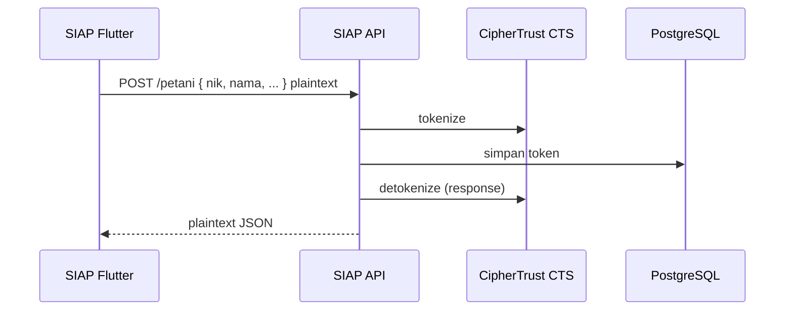

# Arsitektur SIAP

## Overview

SIAP menggunakan **Clean Architecture** dengan **Feature Modular Architecture**. Setiap modul fitur independen dan mengikuti prinsip SOLID.

```
┌─────────────────────────────────────────────┐
│              Presentation Layer             │
│   Pages · Widgets · Bloc (Events/States)    │
└──────────────────┬──────────────────────────┘
                   │ Use Cases
┌──────────────────▼──────────────────────────┐
│               Domain Layer                  │
│   Entities · Repository Contracts · UC      │
│         (Pure Dart — no Flutter)            │
└──────────────────┬──────────────────────────┘
                   │ Repository Interface
┌──────────────────▼──────────────────────────┐
│                Data Layer                   │
│   Models · DataSources · Repository Impl    │
└──────────────────┬──────────────────────────┘
                   │ Dio / SharedPreferences
┌──────────────────▼──────────────────────────┐
│              External / Core                │
│   API · Local Storage · Config · Theme      │
└─────────────────────────────────────────────┘
```

## Layer Rules

### Domain
- Tidak boleh import `flutter` atau package UI
- Berisi entities, repository abstractions, use cases
- Use case satu tanggung jawab per operasi bisnis

### Data
- Implementasi repository
- Models dengan `freezed` + `json_serializable`
- Remote datasource via `DioClient`
- Local datasource via `SharedPrefService`

### Presentation
- `flutter_bloc` untuk state management
- States: Initial → Loading → Success / Error
- UI tidak memanggil API langsung — selalu via Bloc → UseCase

## Dependency Injection

`get_it` di `lib/injection/dependency_injection.dart`:

| Tipe | Registrasi |
|------|-----------|
| Config, Dio, Storage | `lazySingleton` |
| Repositories, Use Cases | `lazySingleton` |
| Blocs | `factory` (fresh per screen) |

## Error Handling

```
Exception (data layer) → Failure (domain) → UI message (presentation)
```

`Result<T>` sealed class:
- `Success(data)`
- `ErrorResult(failure)`

## Routing

`go_router` dengan:
- **Auth guard** — redirect ke login jika belum authenticated
- **Role guard** — cek `UserRole` per route prefix
- **ShellRoute** — sidebar (desktop) / drawer + bottom nav (mobile)

## State Management Pattern

```dart
// Event → Bloc → UseCase → Repository → DataSource
on<FeatureStarted>(_onStarted);

emit(const FeatureState.loading());
final result = await _useCase(params);
switch (result) {
  case Success(:final data): emit(FeatureState.success(data));
  case ErrorResult(:final failure): emit(FeatureState.error(failure.message));
}
```

## Feature Modules

| Feature | Domain Entity | Workflow |
|---------|--------------|----------|
| auth | User | — |
| dashboard | DashboardSummary, DashboardCharts | — |
| petani | Petani | — |
| lahan | Lahan | — |
| asuransi | Asuransi | Draft → Submitted → Verified → Approved/Rejected |
| klaim | Klaim | Draft → Submitted → Survey → Approved/Rejected |
| laporan | LaporanFilter | Export PDF/Excel |
| pengguna | Pengguna | — |

## Code Generation

```bash
dart run build_runner build
```

Digunakan untuk: freezed models, json_serializable, bloc event/state.

## Tokenisasi PII (CipherTrust CTS)

Tokenisasi & detokenisasi PII dilakukan **sepenuhnya di backend API** — aplikasi Flutter tidak perlu perubahan kode.



| Aspek | Detail |
|-------|--------|
| Layer Flutter | Tidak berubah — kirim/terima plaintext via HTTPS |
| Model Dart | `PetaniModel`, `UserModel` tetap field `nik`, `nama`, `email` |
| Offline cache | Hive masih menyimpan plaintext dari API — pertimbangkan kebijakan retensi |
| Dokumentasi API | [api/docs/cts/OVERVIEW.md](../../api/docs/cts/OVERVIEW.md) |

Field PII: `nik`, `nama`, `alamat`, `no_hp`, `email`, `name`, `petani_nama`, `lokasi`.
