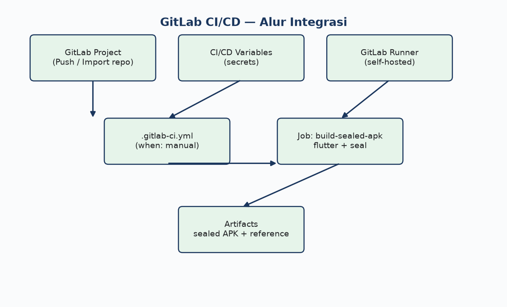

# GitLab CI/CD — Instalasi, Konfigurasi & Pipeline

Panduan lengkap menjalankan build + sealing DoveRunner SIAP di **GitLab CI/CD** (setara dengan GitHub Actions).

---

## Diagram alur GitLab CI



---

## Prasyarat

| Item | Keterangan |
|------|------------|
| GitLab | GitLab.com (SaaS) atau GitLab self-hosted |
| GitLab Runner | `docker` atau `shell` executor dengan Flutter + Java 17 |
| Repo SIAP | Mirror atau push ke GitLab |
| DoveRunner | CLI Key + `sealing.jar` + keystore terdaftar |

---

## Bagian 1 — Setup GitLab Project

### 1.1 Buat / import project

1. GitLab → **New project → Import project → Repository by URL**
2. URL: `https://github.com/miftah-sdt/siap.git` (atau push langsung)
3. Visibility: **Private** (wajib — berisi referensi CI internal)

### 1.2 Aktifkan CI/CD

Project → **Settings → General → Visibility** → pastikan **CI/CD** enabled.

---

## Bagian 2 — Install GitLab Runner (self-hosted)

> GitLab.com shared runner **tidak** punya Flutter/Java pre-installed. Untuk SIAP, gunakan **self-hosted runner** di Ubuntu 22.04/24.04.

### 2.1 Install runner di Ubuntu

```bash
# Add repository GitLab
curl -L "https://packages.gitlab.com/install/repositories/runner/gitlab-runner/script.deb.sh" | sudo bash
sudo apt install -y gitlab-runner

# Verifikasi
gitlab-runner --version
```

### 2.2 Install prasyarat build di mesin runner

```bash
# Java 17
sudo apt install -y openjdk-17-jdk curl git unzip

# Flutter (contoh /opt/flutter)
sudo git clone https://github.com/flutter/flutter.git -b stable /opt/flutter
echo 'export PATH="/opt/flutter/bin:$PATH"' | sudo tee /etc/profile.d/flutter.sh
source /etc/profile.d/flutter.sh
flutter doctor --android-licenses
```

### 2.3 Register runner ke project

1. GitLab project → **Settings → CI/CD → Runners → New project runner**
2. Tag: `flutter`, `android`, `doverunner`
3. Salin **registration token**
4. Di server runner:

```bash
sudo gitlab-runner register \
  --url https://gitlab.com/ \
  --token <REGISTRATION_TOKEN> \
  --executor shell \
  --description "siap-flutter-android" \
  --tag-list "flutter,android,doverunner"
```

Untuk executor **docker**, gunakan image custom yang sudah berisi Flutter + Java (lihat `.gitlab-ci.yml.example`).

### 2.4 Verifikasi runner online

Project → **Settings → CI/CD → Runners** → status **green (online)**.

---

## Bagian 3 — CI/CD Variables (setara GitHub Secrets)

Project → **Settings → CI/CD → Variables → Add variable**

| Variable | Type | Protected | Masked | Isi |
|----------|------|-----------|--------|-----|
| `DOVERUNNER_AUTH_KEY` | Variable | ✓ | ✓ | CLI Key dari DoveRunner Console |
| `SIAP_API_URL` | Variable | ✓ | — | `https://weblog-preparing-packing-came.trycloudflare.com/v1` |
| `DOVERUNNER_API_URL` | Variable | — | — | Opsional (region Jakarta) |
| `DOVERUNNER_SEALING_JAR_URL` | Variable | ✓ | — | URL unduh `sealing.jar` |
| `ANDROID_KEYSTORE_BASE64` | Variable | ✓ | ✓ | Base64 keystore (jika perlu) |
| `ANDROID_KEYSTORE_PASSWORD` | Variable | ✓ | ✓ | Password keystore |
| `ANDROID_KEY_ALIAS` | Variable | ✓ | — | Alias key |
| `ANDROID_KEY_PASSWORD` | Variable | ✓ | ✓ | Password key |

> `sealing.jar` (~2.5 MB) **tidak** bisa disimpan sebagai Variable File jika melebihi limit — gunakan **Generic Package**, **Release asset**, atau `DOVERUNNER_SEALING_JAR_URL`.

### Opsi sealing.jar di GitLab

| Opsi | Cara |
|------|------|
| A — Generic Package | Upload ke **Deploy → Package Registry** |
| B — GitLab Release | Tag `doverunner-tools` + asset `sealing.jar` |
| C — URL secret | `DOVERUNNER_SEALING_JAR_URL` |
| D — Commit repo private | `android/doverunner/sealing.jar` (`git add -f`) |

Upload Generic Package:

```bash
curl --header "PRIVATE-TOKEN: <token>" \
  --upload-file sealing.jar \
  "https://gitlab.com/api/v4/projects/<PROJECT_ID>/packages/generic/doverunner/1.0.0/sealing.jar"
```

---

## Bagian 4 — File `.gitlab-ci.yml`

Salin contoh dari `docs/cicd-doverunner/.gitlab-ci.yml.example` ke root repo:

```bash
cp docs/cicd-doverunner/.gitlab-ci.yml.example .gitlab-ci.yml
git add .gitlab-ci.yml
git commit -m "ci: add GitLab pipeline DoveRunner sealed APK"
git push gitlab main
```

### Trigger pipeline

| Mode | Cara |
|------|------|
| Manual | GitLab → **Build → Pipelines → Run pipeline** |
| Web UI variables | Set `DEPLOY_MODE`, `USE_CALLBACK`, `APP_SIGNING` saat run |
| Scheduled | **CI/CD → Schedules** (opsional nightly build) |

Pipeline **tidak** auto-run on push (sama seperti GitHub — manual `when: manual`).

---

## Bagian 5 — Proses CI/CD step-by-step

```
1. gitlab-runner checkout branch
2. Validasi DOVERUNNER_AUTH_KEY
3. Setup Java 17 + Flutter PATH
4. flutter pub get
5. Resolve SIAP_API_URL (variable / default)
6. Decode keystore (jika ANDROID_KEYSTORE_BASE64 ada)
7. flutter build apk --release --dart-define=...
8. Unduh / pakai sealing.jar
9. bash android/scripts/doverunner-seal.sh
10. (Opsional) apksigner jika app_signing=none
11. Upload artifacts (sealed + unsealed APK)
```

---

## Bagian 6 — Download artifact

1. GitLab → **Build → Pipelines**
2. Klik pipeline **passed** (hijau)
3. Tab **Job** → `build-sealed-apk`
4. **Browse** / **Download** artifacts:
   - `app-release-sealed.apk`
   - `app-release.apk` (referensi)

Retention default: sesuai **Settings → CI/CD → Artifacts** (disarankan 14 hari).

---

## Bagian 7 — GitLab vs GitHub (mapping)

| GitHub Actions | GitLab CI |
|----------------|-----------|
| Repository Secrets | CI/CD Variables |
| `workflow_dispatch` | `when: manual` + Run pipeline |
| `actions/upload-artifact` | `artifacts:` block |
| `github.token` + Release | `CI_JOB_TOKEN` / Package Registry |
| `ubuntu-latest` runner | Self-hosted runner tag `flutter` |

---

## Troubleshooting GitLab

| Masalah | Solusi |
|---------|--------|
| `flutter: command not found` | Install Flutter di runner; cek PATH di `.gitlab-ci.yml` |
| `DOVERUNNER_AUTH_KEY` kosong | Variable harus **unprotected** jika branch non-protected, atau protect branch |
| sealing.jar not found | Upload Package / set URL / commit `-f` |
| Job stuck pending | Runner offline — `sudo gitlab-runner verify` |
| Gradle/SDK error | Jalankan `flutter doctor` di runner host |

---

## Referensi

- [GitLab CI/CD YAML](https://docs.gitlab.com/ee/ci/yaml/)
- [GitLab Runner install](https://docs.gitlab.com/runner/install/)
- [DoveRunner CI/CD Android](https://docs.doverunner.com/mobile-app-security/android/cicd/)
