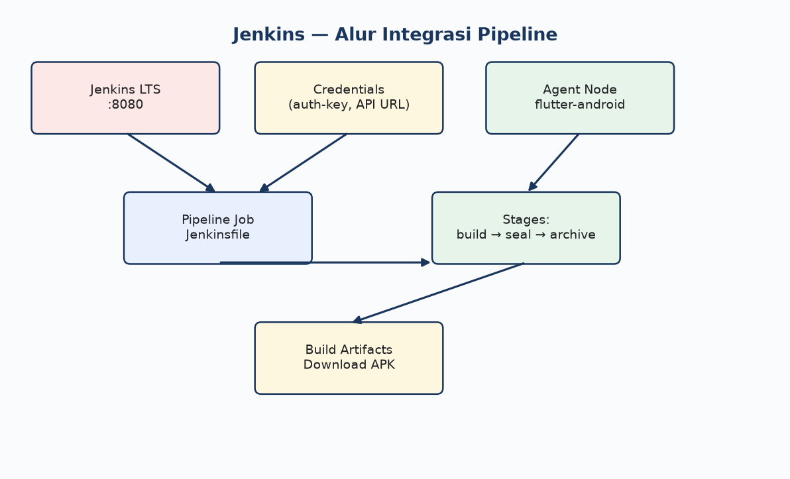

# Jenkins — Instalasi, Konfigurasi & Pipeline

Panduan build + sealing DoveRunner SIAP menggunakan **Jenkins** (Declarative Pipeline + Jenkinsfile).

---

## Diagram alur Jenkins



---

## Prasyarat

| Item | Keterangan |
|------|------------|
| Jenkins | 2.x LTS (Ubuntu VM atau Docker) |
| Agent/Node | Linux dengan Flutter + Java 17 + Android SDK |
| Plugin | Git, Pipeline, Credentials Binding, Timestamper |
| Repo SIAP | Akses git (GitHub/GitLab) |
| DoveRunner | CLI Key + sealing.jar |

---

## Bagian 1 — Install Jenkins (Ubuntu 22.04)

### 1.1 Install via apt (LTS)

```bash
sudo apt update
sudo apt install -y openjdk-17-jdk curl gnupg

# Repository Jenkins
curl -fsSL https://pkg.jenkins.io/debian-stable/jenkins.io-2023.key | \
  sudo tee /usr/share/keyrings/jenkins-keyring.asc > /dev/null
echo "deb [signed-by=/usr/share/keyrings/jenkins-keyring.asc] \
  https://pkg.jenkins.io/debian-stable binary/" | \
  sudo tee /etc/apt/sources.list.d/jenkins.list > /dev/null

sudo apt update
sudo apt install -y jenkins
sudo systemctl enable jenkins
sudo systemctl start jenkins

# Initial admin password
sudo cat /var/lib/jenkins/secrets/initialAdminPassword
```

Buka: `http://<server-ip>:8080` → install suggested plugins → buat admin user.

### 1.2 Alternatif — Jenkins via Docker

```bash
docker run -d --name jenkins \
  -p 8080:8080 -p 50000:50000 \
  -v jenkins_home:/var/jenkins_home \
  -v /opt/flutter:/opt/flutter:ro \
  jenkins/jenkins:lts-jdk17
```

---

## Bagian 2 — Install plugin & tools

**Manage Jenkins → Plugins → Available:**

| Plugin | Fungsi |
|--------|--------|
| Git | Clone repository |
| Pipeline | Jenkinsfile support |
| Credentials Binding | Inject secrets ke pipeline |
| Timestamper | Log timestamp |
| Workspace Cleanup | Bersihkan workspace post-build |

**Manage Jenkins → Tools → JDK:**

- Name: `JDK17`
- Install automatically → Temurin 17

**Manage Jenkins → Nodes → Built-in node** (atau buat agent label `flutter-android`):

Install di node yang sama:

```bash
# Flutter
sudo git clone https://github.com/flutter/flutter.git -b stable /opt/flutter
sudo chown -R jenkins:jenkins /opt/flutter
sudo -u jenkins /opt/flutter/bin/flutter doctor --android-licenses
```

---

## Bagian 3 — Credentials (setara Secrets)

**Manage Jenkins → Credentials → System → Global → Add Credentials**

| ID (wajib exact) | Kind | Isi |
|------------------|------|-----|
| `doverunner-auth-key` | Secret text | CLI Key DoveRunner |
| `siap-api-url` | Secret text | `https://weblog-preparing-packing-came.trycloudflare.com/v1` |
| `doverunner-jar-url` | Secret text | URL unduh sealing.jar (opsional) |
| `android-keystore` | Secret file | File `.keystore` (opsional) |
| `android-keystore-pass` | Secret text | Password keystore |
| `android-key-alias` | Secret text | Alias |
| `android-key-pass` | Secret text | Password key |

> Gunakan **Credential ID** persis seperti di `Jenkinsfile.example` agar binding otomatis.

---

## Bagian 4 — Buat Pipeline Job

### 4.1 New Item

1. **New Item** → nama: `SIAP-Android-DoveRunner-Sealed`
2. Type: **Pipeline**
3. OK

### 4.2 Konfigurasi job

| Tab | Setting |
|-----|---------|
| General | ☑ Discard old builds (keep 10) |
| Build Triggers | — (manual) atau ☑ Poll SCM / webhook |
| Pipeline | Definition: **Pipeline script from SCM** |
| SCM | Git |
| Repository URL | `https://github.com/miftah-sdt/siap.git` |
| Credentials | GitHub PAT (read repo) |
| Branch | `*/main` |
| Script Path | `docs/cicd-doverunner/Jenkinsfile.example` |

Atau copy `Jenkinsfile.example` → `Jenkinsfile` di root repo.

### 4.3 Parameter build (opsional)

Pipeline sudah mendefinisikan parameters:

| Parameter | Default | Pilihan |
|-----------|---------|---------|
| `DEPLOY_MODE` | `release` | test / release |
| `USE_CALLBACK` | `true` | boolean |
| `APP_SIGNING` | `registered_key` | registered_key / none |
| `API_BASE_URL` | *(kosong = secret)* | override URL |

---

## Bagian 5 — Proses CI/CD Jenkins

```
1. Checkout SCM (git clone)
2. Validate DOVERUNNER_AUTH_KEY credential
3. withEnv: JAVA_HOME, FLUTTER_ROOT, PATH
4. flutter pub get
5. Resolve API URL (parameter → credential → default)
6. Decode keystore file credential (jika ada)
7. flutter build apk --release
8. Fetch sealing.jar (workspace / URL / pre-installed path)
9. sh android/scripts/doverunner-seal.sh
10. Archive artifacts (sealed + unsealed APK)
11. Post: cleanup workspace
```

Jalankan: **Dashboard → SIAP-Android-DoveRunner-Sealed → Build with Parameters → Build**

---

## Bagian 6 — Download artifact

Setelah build **SUCCESS**:

1. Klik nomor build (#42)
2. **Build Artifacts** (sidebar kiri)
3. Download:
   - `app-release-sealed.apk`
   - `app-release.apk`

Atau configure **Archive the artifacts** di Jenkinsfile:

```
build/app/outputs/flutter-apk/app-release-sealed.apk
build/app/outputs/flutter-apk/app-release.apk
```

---

## Bagian 7 — Webhook trigger (opsional)

GitHub → repo **Settings → Webhooks**:

| Field | Value |
|-------|-------|
| Payload URL | `http://jenkins:8080/github-webhook/` |
| Content type | application/json |
| Events | Push (branch main) |

Install plugin **GitHub Integration** jika perlu status commit.

> Untuk SIAP + DoveRunner, **disarankan tetap manual** (quota sealing).

---

## Bagian 8 — Jenkins vs GitHub Actions

| GitHub Actions | Jenkins |
|----------------|---------|
| `.github/workflows/*.yml` | `Jenkinsfile` |
| Secrets | Credentials (ID binding) |
| `workflow_dispatch` | Build with Parameters |
| GitHub-hosted runner | Self-managed agent/node |
| Artifacts di Actions tab | Archive Artifacts |

---

## Troubleshooting Jenkins

| Masalah | Solusi |
|---------|--------|
| `flutter: not found` | Set `FLUTTER_ROOT=/opt/flutter` di Jenkinsfile / node env |
| Permission denied keystore | `chown jenkins:jenkins` pada file credential |
| Credential not found | ID harus match `credentials('doverunner-auth-key')` |
| sealing.jar missing | Pre-install di `/var/jenkins/doverunner/sealing.jar` atau URL secret |
| Out of disk | Aktifkan Workspace Cleanup plugin |

---

## Referensi

- [Jenkins Pipeline syntax](https://www.jenkins.io/doc/book/pipeline/syntax/)
- [Credentials plugin](https://plugins.jenkins.io/credentials-binding/)
- [DoveRunner CI/CD](https://docs.doverunner.com/mobile-app-security/android/cicd/)
